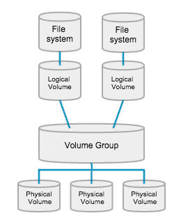
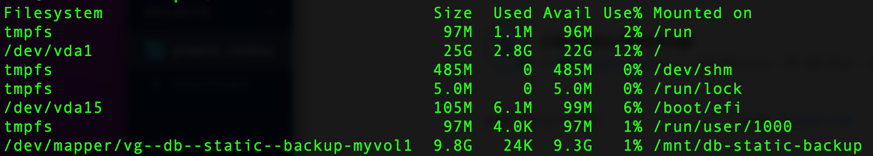
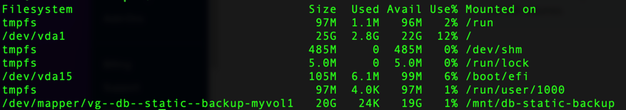

# Mounting & managing storage volumes

Steps:
1. Add additional storage volumes on your server.
2. After you attached the device/volume, what device name did it receive? 
3. Check list of currently mounted devices/volumes on your server. 
4. Create a new partition on this device/volume.
5. Format the new partition.
6. Mount the partition that has been formatted.
7. Check the storage space on your server.
8. How to automatically mount the device after bootup: /etc/fstab file
9. How to automatically mount the device after boot-up: /etc/fstab file
10. Logical Volume Manager (LVM)

## 0. Basics

Naming convention for storage devices in Linux:
- sda (device)
- |_ sda1 (partition)
- |_ sda2 (partition)
- |_ ...


## 1. Add additional storage volumes 

- First decide the additional storage volume that you need. 
- Run the 2 below commands and take a screenshot before attaching the new volume.
  - ```lsblk``` : List block devices.
  - ```sudo fdisk -l``` :  Gives an information listing for storage devices.
- Then in digital ocean / linode, add a new volume to your server.

## 3. What is the name of your newly attached volume/device? 

- After you attached the device/volume, what device name did it receive?
- Run the 2 below commands and take a screenshot after attaching the new volume.
  - ```lsblk``` : List block devices.
  - ```sudo fdisk -l``` :  Gives an information listing for storage devices.
- You should see a new device name in the output of the above commands.

## 4. Check list of currently mounted devices/volumes on your server. 

- ```mount``` command can be used to check what all devices are currently mounted on your server.
- Suppose the new device name that was attached is 'sdb', then check if it is mounted using ```mount | grep sdb```. At this point you must see no output for the above command.
- ```sudo umount /mnt/vol1``` : If you need to unmount

## 5. Create a new partition on this device/volume.

**WARNING: All data will be wiped out on the device!!!** 

- Run the 2 below commands and take a screenshot before creating the new partition.
  - ```lsblk``` : List block devices.
  - ```sudo fdisk -l``` :  Gives an information listing for storage devices.
- ```sudo fdisk /dev/sdb``` : Create a new partition table on this device/volume.
- ```p```: Print the partition table. (Should be none at this point)
- ```g```: Create a new empty GPT partition table.
- ```n```: Add a new partition.
- ```1```: Partition number.
- ```Enter```: First sector.
- ```Enter```: Last sector. (Take up the whole disk)
- ```w```: Write the partition table and exit.

The new partition should be created and the device should be ready to be formatted.

- Run the 2 below commands and take a screenshot before creating the new partition.
  - ```lsblk``` : List block devices.
  - ```sudo fdisk -l``` :  Gives an information listing for storage devices.

## 6. Format the new partition.

If you want to use this as an internal linux filesystem device/volume, use linux filesystem type ext4.

- ```sudo mkfs.ext4 /dev/sdb1```: Format partition in filesystem type ext4

## 7. Mount the partition that has been formatted. 

- Attach the storage volume to any folder/directory on your server.
- Folders/directory considered most appropriate folders: /mnt, /media
  - /media: Mount point for temporary removable devices. Storage volume not going to be attached all the time.
  - /mnt: Mount point for permanent storage volumes. Storage volume going to be attached all the time. Harddrive on a server.

Mount a device/volume to a subdirectory of /mnt.
- ```mkdir /mnt/disk1```: create a directory called /mnt/disk1 with the following command
- ```lsblk```: List block devices before mounting. 
- ```sudo mount /dev/sdb1 /mnt/disk1/```: mount device /dev/sdb1 to directory /mnt/disk1
- ```lsblk```: List block devices after mounting. You should see the device mounted to /mnt/disk1.
- ```df -h```: Show usage of devices/volumes. You should see the device mounted to /mnt/disk1.

## 8. Check the storage space on your server.

- ```sudo apt install ncdu```: Install ncdu if not already installed.
- ```sudo ncdu /```: Check the storage space on your server from the root directory.
- ```enter```: Enter a directory to check the storage space in that directory.
- ```q```: Quit ncdu.

## 9. How to automatically mount the device after boot-up: /etc/fstab file

**WARNING: IF YOU MAKE A MISTAKE EDITING THIS FILE, THE SERVER WILL NOT BOOT. BE WARNED!!!**

- ```/etc/fstab```: Use this file to automatically mount additional volumes at boot time. You can mount disks, storage volumes, etc.

### 9.a. PART I: Use device name to mount the device.

- ```sudo cp /etc/fstab /etc/fstab.bak```: Make a backup of the /etc/fstab file.
- ```mount``` or ```mount | grep sdb```: Check if the device is mounted. 
- If the device is **NOT** mounted, then mount it before editing the /etc/fstab file. Mount it to a directory like /mnt or /media (See above).
- ```sudo nano /etc/fstab```: Edit the /etc/fstab file.
- Add 2 new lines to this file.
- Format of new line: ```</dev/sdb1> </mnt/disk1> <ext4> <defaults> <0> <2>```
  - ```</dev/sdb1>```: Device name.
  - ```</mnt/disk1>```: Directory to mount the device to.
  - ```<ext4>```: Filesystem type.
  - ```<defaults>```: Mount options.
  - ```<0>```: Dump option. 0 means that the filesystem is not backed up by the dump command.
  - ```<2>```: Filesystem check order. 2 means that the filesystem is checked after root and boot filesystems.
- CHECKS: 
  - ```sudo umount /mnt/disk1```: First unmount the device if it is mounted.
  - ```mount | grep sdb```: Check if the device is mounted. You should see the device not mounted to /mnt/disk1.
  - ```sudo mount -a```: Check if there are any errors in the /etc/fstab file. You see no errors.
  - ```mount | grep sdb```: Check if the device is mounted. You should see the device mounted to /mnt/disk1.

### 9.b. PART II: Use UUID instead of device name.

- ```sudo blkid```: Get the UUID of the device.
- Save the UUID. For example: ```/dev/sdb1: UUID="1f2d5db3-b477-4fc0-aa6a-58cd6288dc3c"```
- ```sudo umount /mnt/disk1```: First unmount the device if it is mounted.
- ```sudo nano /etc/fstab```: Edit the /etc/fstab file. Remove the "" around the UUID. Replace the device name with the UUID.
- CHECKS: 
- ```sudo mount -a```: Check if there are any errors in the /etc/fstab file. You see no errors.
- ```mount | grep sdb```: Check if the device is mounted. You should see the device mounted to /mnt/disk1.

#### Using the ```noauto``` option:

```noauto```: means that the filesystem will NOT be automatically mounted.

- ```sudo umount /mnt/disk1```: First unmount the device if it is mounted.
- ```sudo nano /etc/fstab```: Edit the /etc/fstab file. Add the ```noauto``` option to the mount options.
- ```sudo mount -a```: Check if there are any errors in the /etc/fstab file. You see no errors.
- ```mount | grep sdb```: Check if the device is mounted. You should see the device still **NOT** mounted to /mnt/disk1.

This is because the ```noauto``` option means that the filesystem will NOT be automatically mounted.

Advantage: 
- ```sudo mount /mnt/disk1```: Mount the device to /mnt/disk1 without mentioning the device/storage name. Only need to refer to the target directory.

## 10. Logical Volume Manager (LVM)



Notes
1. Physical volume: The actual physical storage device. For example: /dev/sdb1
2. Volume group: A collection of physical volumes. For example: vg-db-static-backup
3. Logical volume: A logical volume is a virtual partition that is created from a volume group. For example: lv-db-static-backup
4. Filesystem: The filesystem is created on the logical volume. For example: ext4
5. Mount point: The mount point is the directory where the filesystem is mounted. For example: /mnt/db-static-backup
6. Resize: You can resize the logical volume as needed.
7. Extend: You can extend the logical volume as needed.
8. Shrink: You can shrink the logical volume as needed.
9. Can 1 physical volume be split into multiple volume groups? No. A physical volume can only belong to 1 volume group. However, a volume group can have multiple physical volumes.
10. Can 1 volume group be split into multiple logical volumes? Yes. A volume group can have multiple logical volumes.
11. Can 1 logical volume be split into multiple filesystems? No. A logical volume can only have 1 filesystem. However, a filesystem can have multiple mount points.
12. Can 1 filesystem be mounted to multiple mount points? Yes. A filesystem can have multiple mount points.
13. Can 1 mount point be mounted to multiple filesystems? No. A mount point can only be mounted to 1 filesystem.


### 10.a. High-level Steps
1. Add physical volume to server.
2. Setup the physical volume (not yet claimed by LVM).
3. Create a volume group.
4. Create a logical volume.
5. Format logical volume to filesystem..
6. Mount the logical volume to a directory.
7. Extend/resize the logical volume as needed.

### 10.b. Step-by-step guide

**WARNING: ```pvcreate``` can wipe out your disk if not correctly named. Be careful.**

1. Add volume to the server on digital ocean/linode.
2. Setup a physical volume (that is not yet claimed by LVM)
   2. ```sudo pvcreate /dev/sda```: Setup physical volume on the new volume.
   3. ```sudo pvdisplay```: Use the command as root to display the physical volumes you have available on your server.
4. Create a volume group
   5. ```sudo vgcreate vg-db-static-backup /dev/sda```: Create a volume group called vg-db-static-backup using the physical volume /dev/sda.
   6. ```sudo vgdisplay```: Use the command as root to display the volume groups you have available on your server.
5. Create a logical volume (and assign a portion of the disk to a logical volume)
   7. ```sudo lvcreate -n myvol1 -L 5g vg-db-static-backup```: Create a logical volume called myvol1 with 5GB of space from the volume group vg-db-static-backup.
   8. ```sudo lvdisplay```: Use the command as root to display the logical volumes you have available on your server.
6. ```sudo mkfs.ext4 /dev/vg-test/myvol1```: Format the logical volume
7. ```sudo mkdir /mnt/db-static-backup```: Create a directory to mount the logical volume to.
8. ```sudo mount /dev/vg-db-static-backup/myvol1 /mnt/db-static-backup```: Mount the logical volume to the directory.
9. ```df -h```: Check the size of the logical volume.
10. ```sudo lvextend -n /dev/vg-db-static-backup/myvol1 -l +100%FREE```: Resize the logical volume to take up the remainder of the physical volume.
11. ```sudo resize2fs /dev/mapper/vg--db--static--backup-myvol1```: Resize the ext4 filesystem that resides on this logical volume.
12. ```df -h```: Check the size of the logical volume.



### 10.c. How to add additional storage space

1. ```df -h```: Check the size of the logical volume.
2. ```lsblk```: Check the storage space you have available.
2. Add volume to the server on digital ocean/linode.
2. Setup a physical volume (that is not yet claimed by LVM)
   2. ```sudo pvcreate /dev/sda```: Setup physical volume on the new volume.
   3. ```sudo pvdisplay```: Use the command as root to display the physical volumes you have available on your server.
4. ```sudo vgextend vg-db-static-backup /dev/sdc```: Add the new physical volume to the volume group. 
   5. ```sudo vgextend <volume-group-to-expand> <using-volume>```
6. ```lsblk```: Check the storage space you have available. There should be no change yet in space listed.
7. ```sudo vgdisplay```: you should see free space available in the volume group.
8. Are you going to expand existing logical volumes or create new logical volumes?
9. If we want to expand exiting logical volumes:
   10. ```sudo lvextend -L +10G /dev/mapper/vg--db--static--backup-myvol1```: Expand the logical volume by 10GB. (Also you can do +100%FREE)
   11. ```sudo resize2fs /dev/mapper/vg--db--static--backup-myvol1```: Resize the ext4 filesystem that resides on this logical volume.
12. ```df -h```: Check the size of the logical volume. You should have the new volume.

### 10.d. How to automatically mount the logical volume on server reboot

See above steps on editing /etc/fstab file.



14. you may have additional physical volumes that have yet to be assigned to a volume group
    * We can add additional physical volumes to our volume group with the vgextend command. E.g: ```sudo vgextend vg-test /dev/sdc```